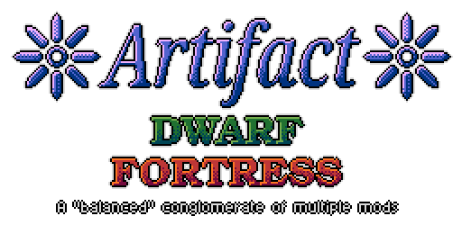
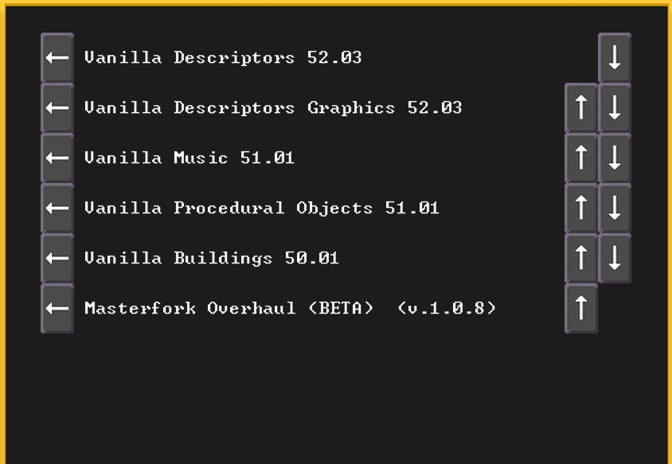

## What?
Artifact Dwarf Fortress is a mod that aims to provide a uniquely balanced worldgen and gameplay experience
while also providing a greatly expanded set of features from a variety of other mods, both old and new.
Our policy is to only include content from authors that have given permission to use their work in this way,
so if you're aware of something in this repository that the original author doesn't want here, [create an issue on Github](https://github.com/zeyonic/df-masterfork/issues) and let us know.

## Balanced?
Part of this modpack's purpose is to ensure worlds are reasonably likely to reach 1000+ years of age without being mostly reduced to ruins.
Destruction of entire civilizations by necromancers should be a significant event that doesn't happen often.

We also want to keep things interesting, so many animals and megabeasts have higher skills than they would have in vanilla.
The world is generally more threatening to your citizens than it normally would be.

Other than that, we want more of pretty much everything.
 - More weapon/armor types
 - More materials, both for forging and construction
 - More plants, farmable or otherwise
 - More creatures
 - More civilizations, playable and non-playable
 - More workshops for fortress mode
 - More crafting recipes for adventure mode
 - More secrets than just necromancy
 - Many other things as well
 
And we want all of this without bringing on the chaotic imbalances that can arise between many mods in a collection. 
Everything that gets added gets changed, sometimes significantly, to better fit Artifact's purposes.
A more specific list of features can be found [here](CHANGES.md).
 
## Will this work with my mod?
This mod replaces the content in almost all of the vanilla modules, changing important names and in some cases relationships between materials.
As a result, Artifact DF is not compatible with most mods on the bay12 forums or Steam workshop.

Some mods may *work* if loaded after Artifact DF, but this isn't a priority for us, and game stability may suffer.
If a given issue can't be replicated with the recommended loading order, it likely won't be fixed.

## Load order?
Once Artifact DF is in your mods folder, all you need to do is change your load order to look like this.

In future versions, we might change which vanilla modules are replaced by this mod. 
If this happens, we'll update this screenshot to show the new order.

## What happened to Masterfork?
This is the same mod, but we've changed the name and logo.
At the advice of a prominent community member, we've decided to ditch the association with Masterwork and call it something new.
The old name didn't really make a whole lot of sense anyway, given that no material from Masterwork itself has been carried over,
meaning this isn't a true fork, just a similar kind of endeavor.
This is largely a new mod, made from the combined work of newer modders, most of whom have their original mods hosted on the workshop.

A list of credits can be found [here](information_and_credits.txt).
